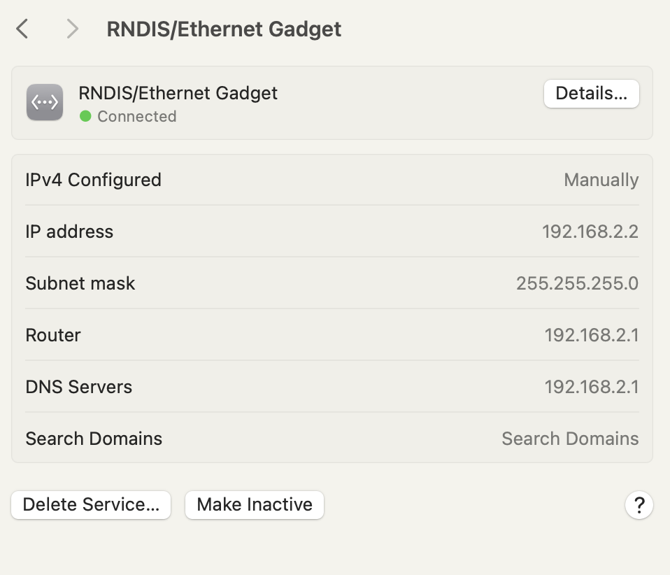

# Pi-Tail Reverse Bluetooth Tethering Configuration

## Overview

[Pi-Tail](https://www.kali.org/docs/arm/raspberry-pi-zero-w-pi-tail/) is a specialized **Kali Linux** image optimized for the **Raspberry Pi Zero 2 W**, designed specifically for portable penetration testing and cybersecurity fieldwork. 

It transforms the compact Raspberry Pi into a **“tail”** device that can be **tethered to a smartphone or PC**, using the host device for power, display (via VNC), keyboard, and internet access — all while keeping the Pi headless and highly portable.

The official Pi-Tail setup typically configures Bluetooth in “server” mode: the Raspberry Pi acts as a Bluetooth access point, allowing your smartphone or PC to pair and connect to it, sharing the host’s internet connection with the Pi via Bluetooth PAN (Personal Area Network).
This repository provides a reverse Bluetooth configuration: the Raspberry Pi acts as the client, actively connecting to your paired smartphone or PC. This approach offers greater reliability in certain scenarios, as it allows the Pi to automatically establish the connection on boot and better handle internet sharing from the host device.

Key Benefits of This Reverse Setup

* Seamless Internet Sharing: The Pi reliably obtains internet access from your phone/PC without manual intervention after initial pairing.
* Systemd Integration: Includes a custom systemd service script to manage the Bluetooth connection automatically at boot.
* Muliple Device Support: Easily configure the Pi to connect to multiple devices (e.g., both an iPhone and an Android phone) with prioritized connection attempts.

This setup is particularly useful for cybersecurity students and professionals needing a discreet, portable Kali environment with consistent network access via Bluetooth tethering.
Feel free to contribute improvements or report issues!

## Prerequisites

- A Raspberry Pi Zero 2 W running Kali Linux (Pi-Tail image recommended). See [Pi-Tail GitHub](https://github.com/Re4son/RPi-Tweaks/tree/master/pi-tail) for setup instructions and more.
- A smartphone or PC capable of Bluetooth tethering.

## Setup Instructions

1. **Initial Configuration**
   access your Raspberry Pi via SSH or terminal and perform initial updates and configurations (default username: kali, password: kali):
   
   ```bash
   sudo apt update
   sudo apt upgrade -y
   ```
   
   change the hostname to a more understandable name for easier identification:
   
   ```bash
   sudo hostnamectl set-hostname printer-pi
   ```
   
   edit the hosts file and systemd resolved configuration to ensure proper DNS resolution:
   
   ```bash
   sudo nano /etc/hosts
   ```
   
   change the dns server settings:
   
   ```bash
   sudo nano /etc/systemd/resolved.conf
   ```
   
   Add or modify the following lines:
   
   ```
   [Resolve]
   DNS=1.1.1.1
   FallbackDNS=9.9.9.9
   ```
   
   Restart the systemd-resolved service to apply changes:
   
   ```bash
   sudo systemctl restart systemd-resolved
   resolvectl status
   ```
   
   Enable and start the Avahi daemon for network service discovery:
   
   ```bash
   sudo systemctl enable avahi-daemon
   sudo systemctl start avahi-daemon
   ```
   
   change the default password for security:
   
   ```bash
   passwd
   ```

2. **Install Required Packages**
   Ensure that BlueZ and other necessary packages are installed on your Raspberry Pi:
   
   ```bash
   sudo apt install bluez bluez-tools bluetooth blueman pulseaudio-module-bluetooth -y
   ```

3. **Pair Your Devices**
   
   > ⚠️ **Important:** Before proceeding with Bluetooth pairing, make sure that Internet Sharing (tethering) is enabled on your smartphone.
   
   - **iPhone:**
     
     1. Go to **Settings** > **Personal Hotspot**.
     2. Toggle **Allow Others to Join** to ON.
     3. Ensure **Maximize Compatibility** is enabled for easier connection.
     4. Bluetooth must be ON.
   
   - **Android:**
     
     1. Go to **Settings** > **Network & Internet** > **Hotspot & tethering**.
     2. Enable **Bluetooth tethering**.
     3. Make sure Bluetooth is ON.
   
   Once Internet Sharing is active, you can proceed with Bluetooth pairing.
   
   Use `bluetoothctl` to pair your Raspberry Pi with your smartphone or PC:
   
   ```bash
   bluetoothctl
   ```
   
   Inside the `bluetoothctl` prompt, use the following commands:
   
   ```bash
   power on
   agent on
   default-agent
   scan on
   ```
   
   Once you see your device, note its MAC address and pair:
   
   ```
   pair XX:XX:XX:XX:XX:XX
   trust XX:XX:XX:XX:XX:XX
   ```
   
   Replace `XX:XX:XX:XX:XX:XX` with your device's MAC address. 
   You may be prompted to confirm the pairing on your smartphone. Accept the pairing request.
   Pair other devices if needed by repeating the above steps.
   Finally, stop scanning and exit:
   
   ```
   scan off
   quit
   ```

4. **Create the Bluetooth PAN Client Script**
   Create the script that will handle the Bluetooth PAN connection:
   
   ```bash
   sudo cp ./auto-bt-pan.sh /usr/local/bin/auto-bt-pan.sh
   ```
   
   Modify the following content regarding your devices in `/usr/local/bin/auto-bt-pan.sh`:
   
   ```bash
   # List of devices in priority order
   # FORMAT: MAC|TYPE|STATIC_IP|GATEWAY|DNS
   DEVICES=(
   "xx:xx:xx:xx:xx:xx|iPhone|172.20.10.2|172.20.10.1|1.1.1.1"
   "yy:yy:yy:yy:yy:yy|Android|192.168.44.2|192.168.44.1|1.1.1.1"
   )
   ```
   
   Make the script executable:
   
   ```bash
   sudo chmod +x /usr/local/bin/auto-bt-pan.sh
   ```

5. **Create Systemd Service**
   Create a systemd service to manage the Bluetooth connection:
   
   ```bash
   sudo cp ./auto-bt-pan.service /etc/systemd/system/auto-bt-pan.service
   ```

6. **Enable and Start the Service**
   Enable and start the Bluetooth PAN client service:
   
   ```bash
   sudo systemctl enable auto-bt-pan.service
   sudo systemctl start auto-bt-pan.service
   ```

7. **Reboot and Test**
   Reboot your Raspberry Pi to apply all changes:
   
   ```bash
   sudo reboot
   ```
   
   After reboot, check if the Bluetooth PAN connection is established and if you have internet access:
   
   ```bash
   ifconfig bnep0
   ping -c 4 google.com 
   ```

## Troubleshooting

Ensure your smartphone or PC has Bluetooth tethering enabled

Check the status of the systemd service:

- ```bash
  sudo systemctl status auto-bt-pan.service
  ```

- Review logs for errors:
  
  ```bash
  journalctl -u auto-bt-pan.service
  ```

## Bonus 1 : Connect via USB on MacOS

To connect a Raspberry Pi Zero 2 W to a Mac via USB and use it for SSH over a single USB cable, you need to enable USB OTG gadget mode on the Pi and configure both the SD card and macOS.

1. What you need
   
   - A data micro‑USB cable (not charge‑only), plugged into the Pi’s USB data port (the inner one, not “PWR IN”) and into your Mac.

2. Edit files on the SD card
   
   - Mount the SD card’s boot partition on the Mac (it may be named “boot” or “bootfs”).
   
   - Replace config.txt with config.eth
     
     ```bash
     mv /Volumes/boot/config.eth /Volumes/boot/config.txt
     ```
   
   - Edit interfaces file
     
     ```bash
     nano /Volumes/boot/etc/network/interfaces
     ```
     
     Add the following lines at the end of the file:
     
     ```
     allow-hotplug usb0
     iface usb0 inet static
     address 192.168.2.3
     netmask 255.255.255.0
     gateway 192.168.2.1
     ```
   
   - Eject the SD card, insert it into the Pi.

3. First boot of the Pi over USB
   
   - Connect the Pi’s USB data port to the Mac with the micro‑USB cable.
   
   - TThe Pi will power from the Mac and expose itself as a USB Ethernet (RNDIS/Ethernet Gadget) network interface, and a yellow dot will appear next to the new USB network interface in macOS Network settings to indicate limited or no internet connectivity.
     
     

4. Configure macOS networking
   Once the Pi has booted in gadget mode:
   Open **System Preferences** > **Network**. A new **RNDIS/Ethernet Gadget** interface should appear.
   
   Click **Details** and configure:
   
   - **TCP/IP Tab:**
     
     - Configure IPv4: **Manually**
     
     - IP Address: `192.168.2.2`
     
     - Subnet Mask: `255.255.255.0`
     
     - Router: `192.168.2.1`
       
       
   
   - **DNS Tab:**
     
     - DNS Servers: `192.168.2.1` or `1.1.1.1`
       
       
   
   Now the RNDIS/Ethernet Gadget will appears as connected (green dot)
   
   

5. **Set Network Service Order** Ensure your network service order has **Wi-Fi** or **Ethernet** listed **above** the **RNDIS/Ethernet Gadget** connection. You can adjust this in **System Preferences** > **Network** > **...** > **Set Service Order**.

After configuration, you should be able to SSH to your Pi at `192.168.2.3`.